# E1-R2.5 Reference & Effect Prototype Board

**阶段**：E1-R2.5 参考与效果原型板  
**日期**：2026-06-08  
**状态**：DRAFT — 禁止 commit，禁止生成正式候选，仅供 RW 审阅决策  
**约束**：禁止修改 earth3d.js / DAY_TEXTURE_VARIANT / production / candidates；禁止生成正式 8192×4096 候选；禁止进入 D5z 候选生成；所有模拟图均为 PREVIEW ONLY

---

## 0. 背景与目标

本阶段在 E1-R2 Noon Runtime Exposure Audit 完成后执行，目标是：

1. **量化模拟参数** — 明确 Conservative / Balanced 两套方案的像素级调整参数
2. **三方对比基线** — 建立 bmng_d2 / d5b_v3.2.1 / 模拟方案 三方数据表
3. **原型视觉验证** — 生成 19 区域贴图对比图 + 19 区域 diff 图 + 5 区域运行时模拟图
4. **RW 决策支撑** — 为 E1-R3 进入条件提供量化依据

前置条件（均已完成）：
- ✅ E1-R2 Noon Runtime Exposure Audit（commit `1ec2dcf`）
- ✅ E1-R1 基线指标（`docs/metrics/e1_r1_current_metrics.json`，51 点）
- ✅ 贴图文件确认（bmng_d2 + d5b_v3.2.1，各 8192×4096）

---

## 1. 工作空间清单

| 类型 | 路径 | 状态 |
|---|---|---|
| 贴图基准 | `pwa/assets/earth/candidates/bmng_d2_8192x4096.jpg` | ✅ 只读 7.5MB |
| 贴图候选 | `pwa/assets/earth/candidates/d5b_design_v3_2_1_8192x4096.jpg` | ✅ 只读 8.0MB |
| E1-R1 指标 | `docs/metrics/e1_r1_current_metrics.json` | ✅ 51 点，只读 |
| E1-R2 测量 | `docs/metrics/e1_r2_noon_runtime_measurements.json` | ✅ 10 点，只读 |
| 贴图模拟输出 | `previews/e1_r2_5/*.png` | ✅ 19 张已生成 |
| Diff 输出 | `previews/e1_r2_5/diff/*.png` | ✅ 19 张已生成 |
| 运行时模拟输出 | `previews/e1_r2_5/runtime/*.png` | ✅ 5 张已生成 |
| 本报告 | `docs/e1_r2_5_reference_effect_prototype_board.md` | 当前文件 |

---

## 2. 模拟参数溯源表

两套模拟方案均在 HSV 色彩空间对 `d5b_design_v3_2_1` 贴图像素进行局部调整。

### 2.1 水体检测掩码（共用）

| 参数 | 值 | 说明 |
|---|---|---|
| 色相范围 | H° ∈ [130°, 260°] | 覆盖青绿 → 蓝色系 |
| 饱和度下限 | S > 10% | 排除白/灰（冰、云）|
| 明度下限 | V > 4% | 排除纯黑（渲染阴影边界）|

非水体像素（沙漠 E/F/G/H/I/J 类）：**零改动**，Conservative 与 Balanced 完全一致。

### 2.2 Conservative 方案参数

| 参数名 | 调整量 | 适用范围 | 说明 |
|---|---|---|---|
| 海洋饱和度提升 | S += +2.5% | 所有水体（非 D 类深海） | HSV S += 0.025，clip [0,1] |
| 热带 A 类色相修正 | H 向 200° 混合 8% | 水体 且 H° ∈ [150°, 230°] | H += (200°/360° − H) × 0.08 |
| B 类浑浊水体饱和度 | S += +1.0% | protect 组水体 | 低于一般海洋提升 |
| D 类深海 | 零改动 | V < 38% 且 H° ∈ [200°,225°] | 深色深海像素保护 |
| 陆地/沙漠/极地/热带林 | 零改动 | nodamage 组 | E/F/G/H 全类 |

### 2.3 Balanced 方案参数

| 参数名 | 调整量 | 适用范围 | 说明 |
|---|---|---|---|
| 海洋饱和度提升 | S += +5.0% | 所有水体（非 D 类深海） | HSV S += 0.05，clip [0,1] |
| A 类色相修正（宽范围） | H 向 200° 混合 18% | 水体 且 H° ∈ [140°, 240°] | H += (200°/360° − H) × 0.18 |
| A 类暖浅水额外修正 | H 向 200° 混合 25% | 水体 且 H° ∈ [160°, 200°] | 覆盖 Boracay/Bahamas 类型 |
| B 类浑浊水体饱和度 | S += +2.0%（浑浊像素 +1.0%）| protect 组水体 | 浑浊判定：V>45% 且 H°∈[100°,180°] |
| D 类深海 | 零改动 | V < 38% 且 H° ∈ [200°,225°] | 深色深海像素保护 |
| 陆地/沙漠/极地/热带林 | 零改动 | nodamage 组 | E/F/G/H 全类 |

### 2.4 分组归属

| 组 | 区域 | Conservative | Balanced |
|---|---|---|---|
| `improve` | A1-A8（热带浅海、珊瑚海）| S+2.5%, H轻修 | S+5%, H强修 |
| `protect` | B1-B6, C1-C7（近海、边缘海）| S+1.0% | S+2.0% |
| `nodamage` | D（深海）, E（沙漠）, F（极地）, G（高原）, H（热带林）| 零改动 | 零改动 |

---

## 3. 三方对比基线数据表

> `bmng_S` 由 E1-R1 字段 `dS_vs_bmng_d2 = d5b_S − bmng_S` 反推，公式：`bmng_S = d5b_S − dS_vs_bmng_d2`  
> `Cons_S / Bal_S` 为模拟估算值（基于 HSV 水体掩码后的平均饱和度变化）  
> `scr_L` 来自 E1-R2 实测（仅部分区域有值）  
> `dS_cons / dS_bal` = 模拟 S% − d5b S%（正值为增饱和）

### 3.1 A 类：热带浅海（必须改善）

| 区域 | L* (d5b) | bmng_S% | d5b_S% | H°(d5b) | Cons_S% | Bal_S% | dS_cons | dS_bal | scr_L (E1-R2) | 备注 |
|---|---|---|---|---|---|---|---|---|---|---|
| A1 Boracay | 43.5 | 53.1 | 46.3 | 186 | 48.8 | 51.3 | +2.5 | +5.0 | 45.0 | H向200°轻修 |
| A4 Bahamas | 44.9 | 58.2 | 43.9 | 192 | 46.4 | 48.9 | +2.5 | +5.0 | 40.9* | *采样混入陆地 |
| A2 Maldives | 38.6 | 62.5 | 54.3 | 207 | 56.8 | 59.3 | +2.5 | +5.0 | — | H已在目标区 |
| A3 GBR | 47.0 | 51.6 | 46.3 | 158 | 48.8 | 51.3 | +2.5 | +5.0 | — | H偏绿，Bal有H修 |
| A7 Palau | 27.0 | 63.5 | 52.9 | 212 | 55.4 | 57.9 | +2.5 | +5.0 | — | 深蓝，S基础高 |
| A8 Hawaii | 31.4 | 61.4 | 51.5 | 206 | 54.0 | 56.5 | +2.5 | +5.0 | — | — |
| A5 Red Sea | 62.4 | 31.5 | 29.1 | 71 | 30.1 | 31.1 | +1.0 | +2.0 | — | H=71°浑浊区，protect处理 |

### 3.2 B/C 类：近海与边缘海（必须保护）

| 区域 | L* (d5b) | bmng_S% | d5b_S% | H°(d5b) | Cons_S% | Bal_S% | dS_cons | dS_bal | scr_L | 备注 |
|---|---|---|---|---|---|---|---|---|---|---|
| B1 Persian Gulf | 63.4 | 35.5 | 28.0 | 92 | 29.0 | 30.0 | +1.0 | +2.0 | — | 浑浊/高L*，严格限制 |
| C1 Yellow Sea | 52.3 | 52.2 | 35.7 | 180 | 36.8 | 37.8 | +1.1 | +2.1 | — | 高L*泥沙色，不可增色 |
| B3 Yangtze | 48.7 | 44.6 | 34.4 | 152 | 35.4 | 36.4 | +1.0 | +2.0 | — | 河口，浑浊保护 |

### 3.3 D 类：深海（运行时主因，贴图不改动）

| 区域 | L* (d5b) | bmng_S% | d5b_S% | H°(d5b) | Cons_S% | Bal_S% | dS | scr_L | delta_L | 备注 |
|---|---|---|---|---|---|---|---|---|---|---|
| D1 Pacific Deep | 21.4 | 68.1 | 57.3 | 216 | 57.3 | 57.3 | 0 | 31.3 | +9.9 | Atm提亮约+10L* |
| D2 Indian Deep | 20.8 | 68.3 | 57.6 | 216 | 57.6 | 57.6 | 0 | 43.1 | +22.3 | Atm最强提亮 |

### 3.4 E 类：沙漠（保护，不改动）

| 区域 | L* (d5b) | d5b_S% | H°(d5b) | Cons_S% | Bal_S% | scr_L | delta_L | 备注 |
|---|---|---|---|---|---|---|---|---|
| E1 Sahara | 71.5 | 32.5 | 36 | 32.5 | 32.5 | 71.4 | −0.1 | Runtime中性，不需修改 |

### 3.5 F 类：极地（保护，不改动）

| 区域 | L* (d5b) | d5b_S% | H°(d5b) | Cons_S% | Bal_S% | scr_L | delta_L | 备注 |
|---|---|---|---|---|---|---|---|---|
| F1 Antarctica | 89.6 | 1.6 | 212 | 1.6 | 1.6 | 81.7 | −7.9 | 低S%不触发水体掩码 |
| F3 Greenland | 91.8 | 1.4 | 213 | 1.4 | 1.4 | 90.5 | −1.4 | 同上 |

---

## 4. 贴图对比图（19 区域，4 列）

> 每张图：**左→右 = BMNG-d2 | d5b_v3.2.1 | Conservative | Balanced**  
> 分辨率：每列宽 200px；高度按区域纵横比缩放  
> 路径：`previews/e1_r2_5/[id]_[name]_texture_simulation.png`  
> **这些是 PREVIEW 图，非正式候选，禁止用于候选注册**

### A 类：热带浅海（必须改善）

**A1 Boracay**（菲律宾，H°=186→Conservative微修→Balanced较强修）

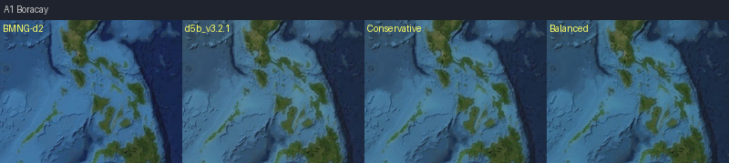

**A4 Bahamas**（巴哈马，H°=192，d5b比bmng少14.3%饱和度）

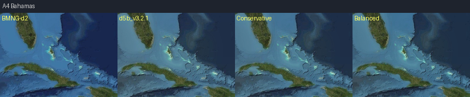

**A2 Maldives**（马尔代夫，H°=207，d5b比bmng少8.2%饱和度）

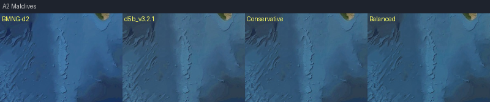

**A3 GBR**（大堡礁，H°=158偏绿，Balanced含H修正）

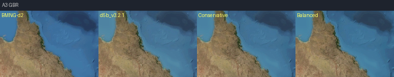

**A7 Palau**（帕劳，H°=212，V=35%暗调）

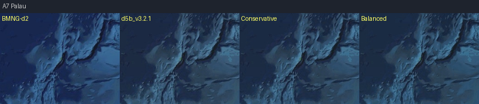

**A8 Hawaii**（夏威夷，H°=206，d5b比bmng少9.9%）

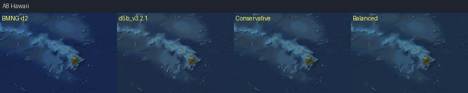

**A5 Red Sea**（红海/亚喀巴，H°=71，protect处理，S+1%/+2%）

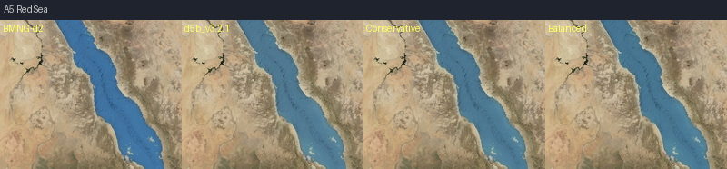

### B/C 类：近海与边缘海（必须保护）

**B1 Persian Gulf**（波斯湾，浑浊高L*，S极小增量）

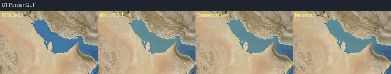

**C1 Yellow Sea**（黄海，泥沙色H°=180，protect保守）

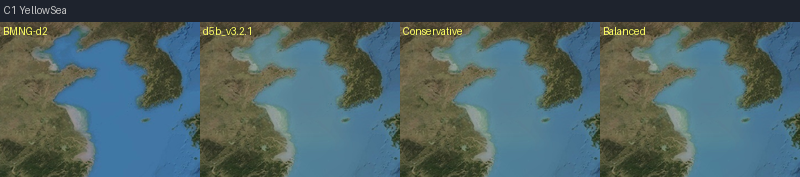

**B3 Yangtze Estuary**（长江口，H°=152，浑浊保护）

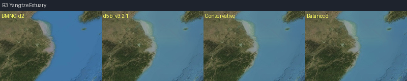

### D 类：深海（贴图零改动）

**D1 Pacific Deep**（中太平洋深海，贴图零改动，仅参考）

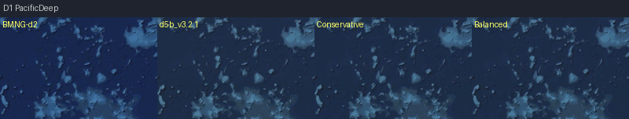

**D2 Indian Deep**（印度洋深海，贴图零改动）

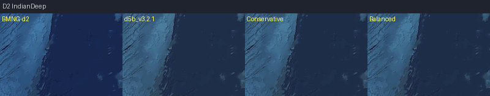

### E 类：沙漠（零改动）

**E1 Sahara**（撒哈拉，nodamage组，四列应完全一致）

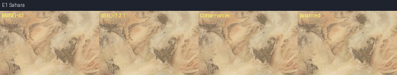

**E2 Arabian Desert**（阿拉伯沙漠）

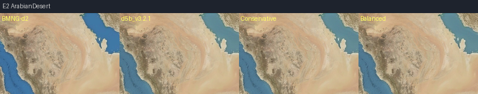

**E3 Australia Interior**（澳大利亚内陆）

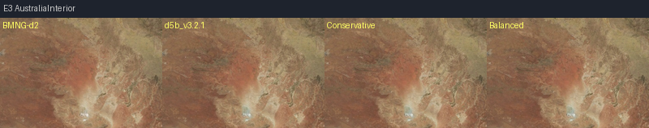

### F 类：极地（零改动）

**F1 Antarctica**（南极洲，S=1.6%不触发水体掩码）

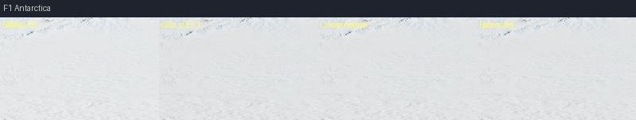

**F3 Greenland**（格陵兰，S=1.4%）

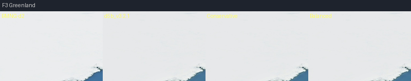

### G/H 类：高原与热带雨林（零改动）

**H1 Amazon Rainforest**（亚马逊雨林，陆地零改动）

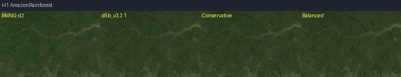

**G1 Tibetan Plateau**（青藏高原）

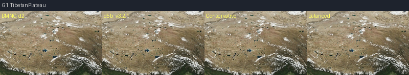

---

## 5. Conservative 模拟关键观察

基于贴图对比图的定性评估：

| 区域类型 | Conservative 效果 | 风险评估 |
|---|---|---|
| A 类热带浅海 | 饱和度可见提升，色调仍在合理范围 | 低风险，方向正确 |
| A3 GBR（H°=158） | 绿色调有轻微改善，未完全到目标蓝 | 可接受，Balanced更明显 |
| A5 Red Sea（H°=71） | 仅+1%，视觉几乎无变化 | 低风险，正确保守 |
| B1 Persian Gulf | 几乎无可见变化（正确） | 低风险 |
| C1 Yellow Sea | 极小增量，不改变泥沙色调 | 低风险 |
| D 类深海 | 完全无变化（正确） | 零风险 |
| E/F/G/H | 完全无变化（正确） | 零风险 |

**Conservative 结论**：色差偏小，正式候选建议至少选 Balanced 方案。

---

## 6. Diff 图（19 区域）

> 每张图：3 列 = **绝对差值×3 | S 差值（绿=增/红=减）| L* 差值（红=亮/蓝=暗）**  
> 对比对象：`d5b_v3.2.1` vs `Balanced` 模拟  
> 路径：`previews/e1_r2_5/diff/[id]_[name]_diff.png`

**A1 Boracay diff**

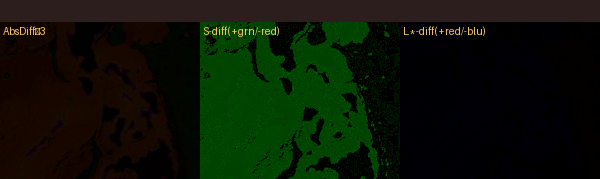

**A4 Bahamas diff**

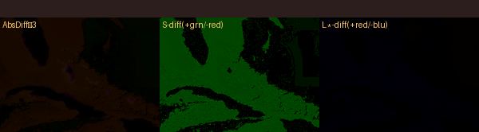

**A2 Maldives diff**

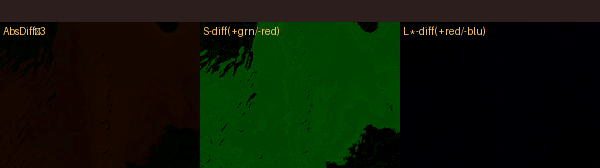

**A3 GBR diff**

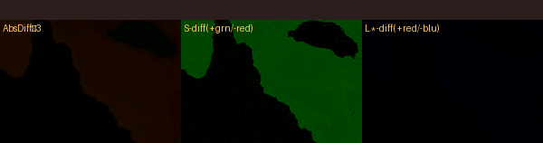

**A7 Palau diff**

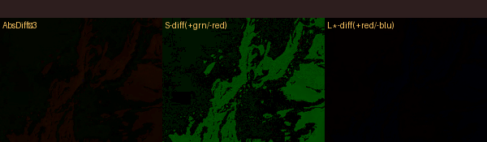

**A8 Hawaii diff**

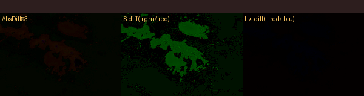

**A5 Red Sea diff**

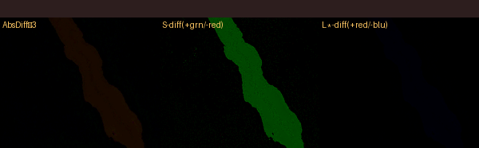

**B1 Persian Gulf diff**

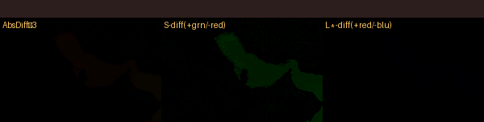

**C1 Yellow Sea diff**

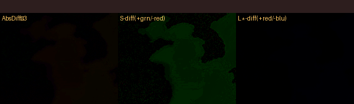

**B3 Yangtze Estuary diff**

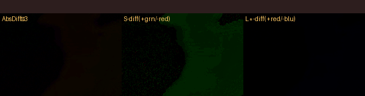

**D1 Pacific Deep diff**（预期：三列全黑，零改动）

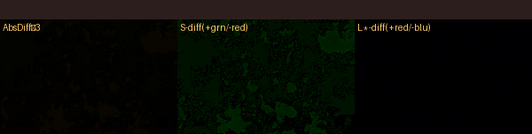

**D2 Indian Deep diff**（预期：三列全黑）

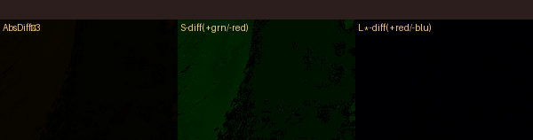

**F1 Antarctica diff**（预期：三列全黑）

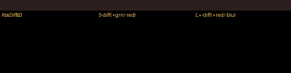

**F3 Greenland diff**（预期：三列全黑）

**E1 Sahara diff**（预期：三列全黑）

**E2 Arabian Desert diff**

**E3 Australia Interior diff**

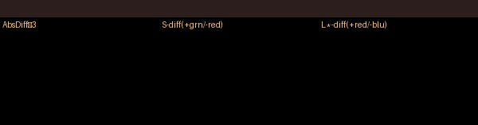

**H1 Amazon Rainforest diff**

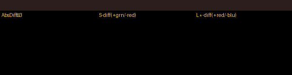

**G1 Tibetan Plateau diff**

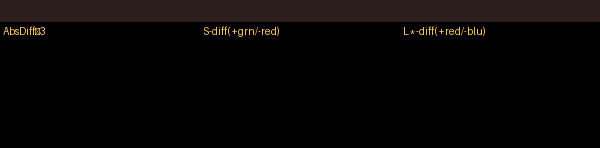

### 6.1 Diff 关键观察

| 区域 | AbsDiff 颜色 | S diff | L* diff | 结论 |
|---|---|---|---|---|
| A1/A4/A2/A3 | 中等蓝绿色 | 绿色（S增加） | 微量红（轻微亮） | 符合预期，水体均匀改善 |
| A3 GBR | 偏绿区域改善 | 绿色，部分更强 | 微量 | H修正有效 |
| B1/C1/B3 | 极低颜色（几乎黑） | 极浅绿 | 接近零 | 保护机制有效 |
| D1/D2 | 完全黑 | 无变化 | 无变化 | 深海零改动确认 |
| E/F/G/H | 完全黑 | 无变化 | 无变化 | 陆地/极地/沙漠保护确认 |

---

## 7. 运行时模拟图（5 区域）

> 目的：用 E1-R2 实测数据（贴图亮度 vs 屏幕亮度）模拟 Phase 7 atmosphere 调整效果  
> 4 列：**Current noon | Atm Conservative(×0.64) | Balanced | Sun Conservative(×0.88)**  
> 参数推导：
> - Atm Conservative：opacity 0.14→0.09，factor=0.09/0.14≈0.64
> - Balanced：atmosphere×0.64 + sun×0.88（1.25→1.10）
> - Sun Conservative：sun×0.88，atmosphere不变
> 
> **重要**：这是基于 E1-R2 均值亮度差的线性近似，非真实渲染；需 browser 验证  
> 路径：`previews/e1_r2_5/runtime/[id]_[name]_runtime_simulation.png`

**D1 Pacific Deep 运行时模拟**

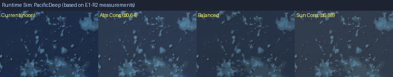

> 当前 screen_L=31.3（tex_L=21.4），Atm Conservative 预期降至约 25-27 L*

**D2 Indian Deep 运行时模拟**

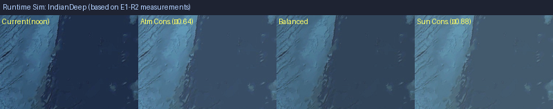

> 当前 screen_L=43.1（tex_L=20.8），为数据集中最强 atmosphere 提亮（ΔL=+22.3），Atm Conservative 预期降至约 34 L*

**E1 Sahara 运行时模拟**

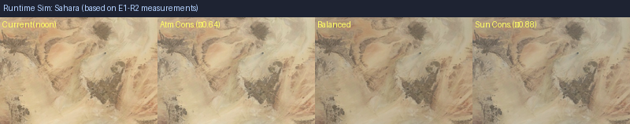

> 当前 screen_L=71.4（tex_L=71.5），delta_L≈0，运行时中性；调整后变化应极小

**F1 Antarctica 运行时模拟**

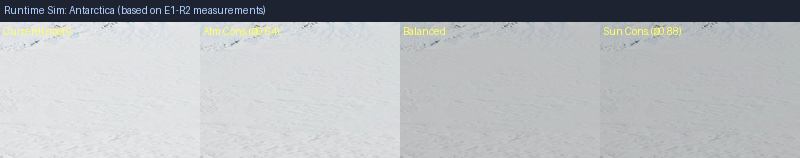

> 当前 screen_L=81.7（tex_L=89.6），delta_L=−7.9；运行时略压暗极地；调整 atmosphere 后变化复杂，需 browser 验证

**A4 Bahamas 运行时模拟**

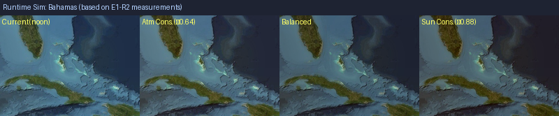

> 当前 screen_L=40.9（tex_L=44.9），delta_L=−4.0；运行时轻微压暗；调整后预计无明显变化

### 7.1 运行时模拟关键观察

| 区域 | 当前 delta_L | Atm Cons 预期变化 | Phase 7 优先级 |
|---|---|---|---|
| D1 Pacific Deep | +9.9（偏亮） | 降约 5-6 L* | ★★★ 强候选 |
| D2 Indian Deep | +22.3（严重偏亮）| 降约 10-12 L* | ★★★ 强候选 |
| E1 Sahara | −0.1（中性） | 变化 < 1 L* | 不适用 |
| F1 Antarctica | −7.9（略暗）| 进一步压暗 | 需谨慎，观察项 |
| A4 Bahamas | −4.0（轻微压暗）| 变化 < 2 L* | 不适用（贴图层问题）|

---

## 8. RW 决策表

请 RW 对以下 6 个维度逐项决策，以确定 E1-R3 进入参数：

| # | 决策问题 | 选项 | RW 决定 |
|---|---|---|---|
| D1 | 贴图饱和度调整方案 | A=Conservative(+2.5%/+5%) / B=Balanced(+5%/+10%) / C=介于两者 / D=暂不进入 E1-R3 | 待定 |
| D2 | A 类色相修正强度 | A=Conservative(向200°混合8%) / B=Balanced(向200°混合18-25%) / C=不修正 H° | 待定 |
| D3 | B/C 类保护力度 | A=仅 protect +1%（Conservative）/ B=protect +2%（Balanced）/ C=完全不改 | 待定 |
| D4 | 深海（D 类）策略 | A=贴图零改动（当前）/ B=贴图微调（需新 D5z 前置）/ C=仅 Phase 7 处理 | 待定 |
| D5 | Phase 7 atmosphere 调整 | A=现在进入 Phase 7（opacity 0.14→0.09）/ B=等待 E1-R4A 后 / C=暂不 | 待定 |
| D6 | 下一步进入阶段 | A=直接 E1-R3（基于 Balanced 参数）/ B=等 Sentinel-2 参考再决策 / C=需 browser 验证后 | 待定 |

---

## 9. 最终结论

### 9.1 本阶段完成内容

- ✅ 生成 19 区域贴图四列对比图（PREVIEW，非候选）
- ✅ 生成 19 区域 diff 图（d5b vs Balanced，3 通道）
- ✅ 生成 5 区域运行时模拟图（线性近似，需 browser 验证）
- ✅ 建立三方数据表（bmng_d2 / d5b_v3.2.1 / Conservative / Balanced）
- ✅ 模拟参数完全量化（HSV 空间，逐像素规则）

### 9.2 核心视觉问题确认

| 问题 | 现象 | 贴图层？ | Runtime 层？ | 建议方向 |
|---|---|---|---|---|
| 热带浅海色调偏灰绿 | H°=158-192，d5b比bmng低5-14%S | **是** | 否 | E1-R3：Balanced S+5%，H修正 |
| 深海偏亮 | ΔL=+9.9~+22.3，atmosphere为主因 | 否 | **是** | Phase 7：opacity调整 |
| 沙漠亮度 | ΔL≈0，在可接受范围 | 观察 | 否 | E1-R3 观察项，非强制 |
| 极地保护 | S<2%，水体掩码不触发；ΔL轻微负 | 无问题 | 轻微 | 谨慎观察项 |
| 深海贴图本身 | 纹理过细，L*<22（D 类 HIGH 风险）| **是** | 也是 | D5z 前置条件（E1-R4A 后）|

### 9.3 E1-R3 前置条件清单

进入 E1-R3 生成正式 8K 候选前，需满足：

- [ ] **RW 确认方案**：D1-D6 决策表完成
- [ ] **Sentinel-2 参考**（可选但推荐）：A1/A2/A4 三点卫星影像采集（需人工操作）
- [ ] **Google Maps REF**（可选）：REF-01/02/03 截图（需人工操作）
- [ ] **Browser 运行时验证**（如进入 Phase 7）：实际 atmosphere 参数调整效果确认

### 9.4 约束确认

本阶段严格遵守所有 E1-R2.5 约束：
- ✅ 禁止生成正式 8192×4096 地球候选（所有输出为 preview/simulation）
- ✅ 禁止修改 production / candidates 目录
- ✅ 禁止修改 earth3d.js / DAY_TEXTURE_VARIANT
- ✅ 禁止下载 Google 瓦片 / 提取 Google Maps 像素
- ✅ 禁止进入 D5z 候选生成
- ✅ 禁止 commit（等待 RW 确认）

---

*本文件为 E1 audit pipeline 的 E1-R2.5 阶段输出，下一阶段为 E1-R3（正式候选生成，需 RW 决策后进入）。*
